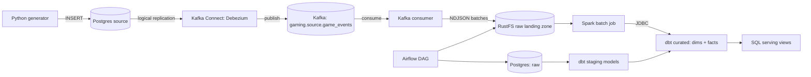

# Gaming Lakehouse Pipeline

End-to-end data platform for a gaming-industry use case: which player
segments and game titles drive revenue, and where do early churn signals
show up in the session/purchase funnel. Built incrementally, phase by
phase — this delivery covers **Phase 0: Infrastructure & Project
Skeleton**. See [`docs/PROJECT_PLAN.md`](docs/PROJECT_PLAN.md) for the full
problem statement, data model, and phase roadmap.

## Architecture



Full component-by-component walkthrough: `docs/PROJECT_PLAN.md`, section 3.

## Tech Stack

| Layer | Technology |
|---|---|
| Source database | PostgreSQL 16.4 (`wal_level=logical`) |
| Change data capture | Kafka Connect + Debezium PostgreSQL connector 2.7.3 |
| Streaming backbone | Apache Kafka 3.8.0 (KRaft mode) |
| Kafka observability | Kafka UI (Provectus) 0.7.2 |
| Raw object storage | RustFS 1.0.0 (S3-compatible) |
| Warehouse | PostgreSQL 16.4 (separate instance) |
| Transformation (dims/facts) | dbt-core 1.8.7 / dbt-postgres |
| Batch processing (aggregates) | Apache Spark 3.5.3 (standalone master+worker) |
| Orchestration | Apache Airflow 2.10.2 |
| Containerization | Docker Compose |

Full justification and rejected alternatives: `docs/PROJECT_PLAN.md`, section 4.

## Prerequisites

- Docker + Docker Compose v2
- Python 3.11+
- ~6-8 GB free RAM for the local stack (2x Postgres, Kafka, Kafka Connect,
  RustFS, Spark master+worker, Airflow webserver+scheduler)

## Setup

```bash
git clone <repo-url> && cd gaming-data-pipeline-e2e
cp .env.example .env
# Edit .env and replace every <CHANGE_ME> — .env.example documents how to
# generate each value (Fernet key, secret key, etc.). Never commit .env.

docker compose -f infra/docker-compose.yml --env-file .env up -d
docker compose -f infra/docker-compose.yml --env-file .env ps   # wait for all services "healthy"

# Register the Debezium PostgreSQL source connector (one-time, after the stack is healthy)
set -a && source .env && set +a
./infra/kafka-connect/register-connector.sh
```

- Airflow UI: http://localhost:8080 (credentials: `AIRFLOW_ADMIN_USER` / `AIRFLOW_ADMIN_PASSWORD` from `.env`)
- RustFS console: http://localhost:9001
- Spark master UI: http://localhost:8081
- Kafka Connect REST API: http://localhost:8083
- Kafka UI: http://localhost:8085
- Postgres (source): `localhost:5433`, database from `SOURCE_POSTGRES_DB`
- Postgres (warehouse): `localhost:5432`, database from `POSTGRES_DB`
- Kafka broker: `localhost:9092`

Local Python environment, for running the generator or tests outside Docker:

```bash
python3 -m venv .venv && source .venv/bin/activate
pip install -r requirements.txt
PYTHONPATH=. pytest -q
```

## Stopping / Restarting Infrastructure

```bash
# Stop, keep data (named volumes persist)
docker compose -f infra/docker-compose.yml --env-file .env down

# Restart — state (both Postgres instances, Kafka log, RustFS objects) survives
docker compose -f infra/docker-compose.yml --env-file .env up -d

# Full reset — deletes all volumes/state
docker compose -f infra/docker-compose.yml --env-file .env down -v
```

## Project Structure

```
.
├── docs/
│   └── PROJECT_PLAN.md              # full plan: problem, data model, pipeline design, DQ, roadmap
├── infra/
│   ├── docker-compose.yml           # postgres (source+warehouse), kafka, kafka-connect, rustfs, spark, airflow
│   ├── postgres/init.sql            # creates raw / staging / curated schemas on first boot (warehouse)
│   ├── postgres-source/init.sql     # creates source.game_events OLTP table watched by Debezium
│   └── kafka-connect/
│       ├── postgres-source-connector.json  # Debezium PostgreSQL connector config
│       └── register-connector.sh           # registers the connector against the Connect REST API
├── ingestion/
│   ├── schemas.py                   # dataclasses for the reduced gaming entity set
│   ├── producer/
│   │   ├── generator.py             # synthetic event generator (dirty data + schema drift)
│   │   └── db_writer.py             # CLI: writes generated events into Postgres source.game_events
│   └── consumer/
│       └── kafka_to_rustfs.py       # CLI: consumes the CDC topic, lands NDJSON batches in RustFS
├── orchestration/
│   └── dags/gaming_pipeline_dag.py  # Airflow DAG skeleton (load -> dbt staging/curated + spark batch)
├── transformation/
│   ├── dbt_gaming/                  # dbt project: staging passthrough model, curated dims/facts placeholder
│   └── spark_jobs/
│       └── daily_engagement_batch.py  # Spark batch job skeleton: RustFS -> agg_player_daily_engagement
├── config/
│   └── settings.py                  # single source of truth for all environment configuration
├── tests/
│   ├── ingestion/                   # generator unit tests
│   └── transformation/              # dbt project structure tests
├── .env.example                     # every required environment variable, documented
└── requirements.txt                  # pinned Python dependencies
```

Every top-level directory maps directly to a stage in the architecture
diagram above: `ingestion` = source + ingestion, `infra` = storage/warehouse
infrastructure, `transformation` = transformation (both dbt and Spark),
`orchestration` = scheduling, `config` = central configuration, `tests` =
automated checks, `docs` = planning and design documentation.

## Current Status — Phase 0

Delivered:
- Docker Compose brings up: source Postgres (CDC-enabled), warehouse
  Postgres, Airflow's metadata Postgres, Kafka, Kafka Connect (Debezium),
  RustFS, Spark (master + worker), and Airflow (webserver + scheduler) —
  all with pinned image versions, healthchecks, and persistent named
  volumes.
- `raw` / `staging` / `curated` schemas are created in the warehouse, and
  `source.game_events` is created in the source database, on first boot.
- Ingestion skeleton: a synthetic gaming-event generator (with configurable
  dirty-record and schema-drift rates) plus a Postgres writer CLI
  (`db_writer.py`) and a Kafka-to-RustFS consumer CLI, both runnable and
  unit-tested. The Debezium connector config is defined but registration
  is a manual, documented step (`register-connector.sh`) — continuous
  end-to-end CDC flow is a Phase 1 deliverable.
- Orchestration skeleton: one Airflow DAG defining the intended task graph
  (`load_raw_to_postgres → dbt_run_staging → dbt_run_curated`, and
  `load_raw_to_postgres → spark_batch_daily_engagement`), created paused
  since task bodies are placeholders.
- Transformation skeleton: a dbt project (`dbt_gaming`) with a real,
  compilable staging passthrough model and a documented curated-layer
  placeholder, plus a Spark batch job skeleton with a working CLI
  (`--help`, argument parsing) and no aggregation logic yet.
- No business logic, real data loading, real transformations, or real
  Spark aggregation are implemented yet — that is explicitly out of scope
  for Phase 0 per the assignment and is scheduled for Phases 1–3
  (`docs/PROJECT_PLAN.md`, section 8).

Not yet implemented (by design, later phases): real raw-to-Postgres
loading, cleaned staging models, curated dimensional model, real Spark
aggregation logic, dbt tests wired into the DAG, serving views, CI/PR
workflow.
