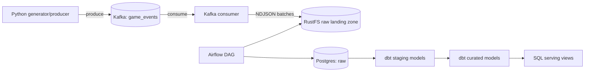

# Gaming Lakehouse Pipeline

End-to-end data platform for a gaming-industry use case: which player
segments and game titles drive revenue, and where do early churn signals
show up in the session/purchase funnel. Built incrementally, phase by
phase — this delivery covers **Phase 0: Infrastructure & Project
Skeleton**. See [`docs/PROJECT_PLAN.md`](docs/PROJECT_PLAN.md) for the full
problem statement, data model, and phase roadmap.

## Architecture



Full component-by-component walkthrough: `docs/PROJECT_PLAN.md`, section 3.

## Tech Stack

| Layer | Technology |
|---|---|
| Streaming ingestion | Apache Kafka 3.8.0 (KRaft mode) |
| Raw object storage | RustFS 1.0.1 (S3-compatible) |
| Warehouse | PostgreSQL 16.4 |
| Transformation | dbt-core 1.8.7 / dbt-postgres |
| Orchestration | Apache Airflow 2.10.2 |
| Containerization | Docker Compose |

Full justification and rejected alternatives: `docs/PROJECT_PLAN.md`, section 4.

## Prerequisites

- Docker + Docker Compose v2
- Python 3.11+
- ~4 GB free RAM for the local stack (Postgres x2, Kafka, RustFS, Airflow webserver+scheduler)

## Setup

```bash
git clone <repo-url> && cd data-engineer-e2e-task
cp .env.example .env
# Edit .env and replace every <CHANGE_ME> — .env.example documents how to
# generate each value (Fernet key, secret key, etc.). Never commit .env.

docker compose -f infra/docker-compose.yml up -d
docker compose -f infra/docker-compose.yml ps   # wait for all services "healthy"
```

- Airflow UI: http://localhost:8080 (credentials: `AIRFLOW_ADMIN_USER` / `AIRFLOW_ADMIN_PASSWORD` from `.env`)
- RustFS console: http://localhost:9001
- Postgres (warehouse): `localhost:5432`, database from `POSTGRES_DB`
- Kafka broker: `localhost:9092`

Local Python environment, for running the generator or tests outside Docker:

```bash
python3 -m venv .venv && source .venv/bin/activate
pip install -r requirements.txt
PYTHONPATH=. pytest -q
```

## Stopping / Restarting Infrastructure

```bash
# Stop, keep data (named volumes persist)
docker compose -f infra/docker-compose.yml down

# Restart — state (Postgres data, Kafka log, RustFS objects) survives
docker compose -f infra/docker-compose.yml up -d

# Full reset — deletes all volumes/state
docker compose -f infra/docker-compose.yml down -v
```

## Project Structure

```
.
├── docs/
│   └── PROJECT_PLAN.md         # full plan: problem, data model, pipeline design, DQ, roadmap
├── infra/
│   ├── docker-compose.yml      # postgres (x2), kafka, rustfs, airflow — single-command local infra
│   └── postgres/init.sql       # creates raw / staging / curated schemas on first boot
├── ingestion/
│   ├── schemas.py              # dataclasses for the reduced gaming entity set
│   ├── producer/
│   │   ├── generator.py        # synthetic event generator (dirty data + schema drift)
│   │   └── kafka_producer.py   # CLI: publishes events onto the Kafka topic
│   └── consumer/
│       └── kafka_to_rustfs.py  # CLI: consumes Kafka, lands NDJSON batches in RustFS
├── orchestration/
│   └── dags/gaming_pipeline_dag.py  # Airflow DAG skeleton (load -> dbt staging -> dbt curated)
├── transformation/
│   └── dbt_gaming/              # dbt project: staging passthrough model, curated placeholder
├── config/
│   └── settings.py              # single source of truth for all environment configuration
├── tests/
│   ├── ingestion/                # generator unit tests
│   └── transformation/           # dbt project structure tests
├── .env.example                  # every required environment variable, documented
└── requirements.txt               # pinned Python dependencies
```

Every top-level directory maps directly to a stage in the architecture
diagram above: `ingestion` = source + ingestion, `infra` = storage/warehouse
infrastructure, `transformation` = transformation, `orchestration` =
scheduling, `config` = central configuration, `tests` = automated checks,
`docs` = planning and design documentation.

## Current Status — Phase 0

Delivered:
- Docker Compose brings up Postgres (warehouse), Postgres (Airflow
  metadata), Kafka, RustFS, and Airflow (webserver + scheduler) with
  pinned image versions, healthchecks, and persistent named volumes.
- `raw` / `staging` / `curated` schemas are created in the warehouse on
  first boot.
- Ingestion skeleton: a synthetic gaming-event generator (with configurable
  dirty-record and schema-drift rates) plus a Kafka producer and a
  Kafka-to-RustFS consumer CLI, both runnable and unit-tested.
- Orchestration skeleton: one Airflow DAG defining the intended task graph
  (`load_raw_to_postgres → dbt_run_staging → dbt_run_curated`), created
  paused since task bodies are placeholders.
- Transformation skeleton: a dbt project (`dbt_gaming`) with a real,
  compilable staging passthrough model and a documented curated-layer
  placeholder.
- No business logic, real data loading, or real transformations are
  implemented yet — that is explicitly out of scope for Phase 0 per the
  assignment and is scheduled for Phases 1–3 (`docs/PROJECT_PLAN.md`,
  section 8).

Not yet implemented (by design, later phases): real raw-to-Postgres
loading, cleaned staging models, curated dimensional model, dbt tests
wired into the DAG, serving views, CI/PR workflow.
