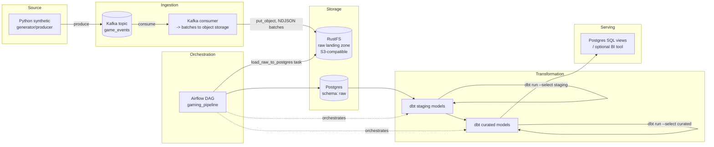

# PROJECT_PLAN — Gaming Player Engagement & Monetization Analytics Platform

## 1. Problem Statement

**Industry:** Gaming (mobile / online multiplayer platform).

**Business question:** Which player segments and which game titles drive
revenue, and where in the session/engagement funnel do we see early churn
signals (drop-off between session start and repeat play, or between first
purchase and repeat purchase)?

**Consumer of the data:** the Product/Growth analytics team.

**Decision the output supports:** which player segments to target with a
retention campaign, and which game titles justify further engineering/
marketing investment. Concretely, the curated `agg_player_daily_engagement`
and `fct_in_game_transaction` models feed a weekly review where Growth
decides campaign budget allocation per game/segment.

**Reference data model:** the entity set (`player`, `game_title`, `device`,
`game_session`, `in_game_transaction`, `campaign`) is a deliberately reduced
subset of the **Gaming** industry model published in
[`databricks-industry-solutions/lakehouse-industry-data-models`](https://github.com/databricks-industry-solutions/lakehouse-industry-data-models/tree/main/data-models/gaming)
(the MVM variant contains 14 domains / 176 tables; this project implements
the "player session & monetization" slice of it end-to-end rather than the
full breadth).

## 2. Data Sources

| Attribute | Detail |
|---|---|
| Origin | Self-written Python synthetic generator (`ingestion/producer/generator.py`), not a scrape or third-party API, chosen so volume, drift, and dirtiness are fully controllable and reproducible for grading. |
| Format | JSON events, one per Kafka message. |
| Volume estimate | Configurable via `GENERATOR_EVENTS_PER_SECOND` (default 5/s ≈ 432k events/day) — enough to exercise batching/partitioning without needing a cluster. |
| Update frequency | Continuous (streaming) at the source; landed into the raw zone in micro-batches (Phase 1 default: every 200 messages or on a time-based Airflow schedule). |
| Sample record | See `ingestion/schemas.py::GameEvent` — `{event_id, event_type, event_time, player{...}, device{...}, game{...}, session_id, amount_usd, currency, extra{...}}`. |
| Known quality issues (injected on purpose) | `GENERATOR_DIRTY_RECORD_RATE` fraction of events have a null `player.player_id`, a negative `amount_usd`, or a malformed `event_time`. `GENERATOR_SCHEMA_DRIFT_RATE` fraction carry an undocumented `ab_test_cohort` field, simulating a client SDK upgrade landing new attributes without a schema migration. |

## 3. Target Architecture



**Component walkthrough:**

- **Generator/producer** — emits realistic, imperfect events; the only
  component that "invents" data, so every downstream quality problem is
  traceable to a known, documented cause.
- **Kafka (`game_events` topic)** — decouples the producer from the rest of
  the pipeline, gives replay capability (consumer group offsets), and
  simulates a real streaming source instead of a static file drop.
- **Kafka consumer → RustFS** — a thin, stateless writer that never
  transforms data; it only batches messages and writes them as
  newline-delimited JSON objects, keyed by offset range for idempotent
  re-runs. This is the "ingestion" step of the pipeline.
- **RustFS** — S3-compatible object storage acting as the raw landing
  zone / data lake layer, so raw data is durable and queryable by any
  S3-aware tool before it ever touches the warehouse.
- **Postgres `raw` schema** — the warehouse-side copy of the same raw data,
  loaded by an Airflow task (`load_raw_to_postgres`) so SQL-based
  transformation (dbt) can operate on it.
- **dbt staging models** — 1:1 cleaned/typed views on top of `raw` (dedup,
  casts, explicit handling of drifted/dirty fields). Materialized as views
  to avoid duplicating storage.
- **dbt curated models** — dimensional/fact tables and the
  `agg_player_daily_engagement` aggregate that Growth actually queries.
  Materialized as tables for query performance.
- **Airflow** — schedules and sequences `load_raw_to_postgres → dbt run
  staging → dbt run curated`, owns retry/failure handling.
- **Serving layer** — plain SQL views over the curated schema; a BI tool
  (e.g. Metabase) can point at these directly. Kept deliberately simple —
  no new tool required to serve the data.

## 4. Tech Stack Table

| Component | Chosen technology | Reason | Rejected alternative |
|---|---|---|---|
| Streaming ingestion | Apache Kafka (`apache/kafka:3.8.0`, KRaft mode) | Decouples producer from storage, gives replay via consumer offsets, matches how a real game telemetry pipeline ingests events | Direct file drop from the generator (no replay, no backpressure handling, unrealistic for "source → ingestion") |
| Raw object storage (landing zone) | **RustFS** (`rustfs/rustfs:1.0.1`) | S3-compatible, single lightweight Rust binary, trivial to run in Docker Compose, gives a real data-lake landing zone before the warehouse | MinIO (functionally similar; RustFS chosen per project scope to use a different S3-compatible engine); local filesystem (no S3 API, not realistic) |
| Warehouse | PostgreSQL 16.4 | SQL-based transformation target, widely supported by dbt, easy to run and inspect locally | DuckDB (weaker multi-user/concurrent access story for a pipeline with Airflow + dbt both connecting) |
| Transformation | dbt-core 1.8.7 + dbt-postgres | Staging → curated layering with built-in tests, docs, and lineage; industry-standard for this exact pattern | Hand-written SQL scripts run by Airflow (no built-in testing/docs, harder to maintain) |
| Orchestration | Apache Airflow 2.10.2 | DAG-based scheduling, task-level retries, clear dependency graph between load/staging/curated steps | Cron + shell scripts (no dependency graph, no UI, no built-in retry semantics) |
| Data quality | dbt built-in tests (`not_null`, `unique`, `relationships`, `accepted_values`) | Declared alongside the models they test, runs as part of `dbt test`, no extra service | Great Expectations (a second DQ framework — not justified given dbt tests already cover the required checks) |
| Containerization | Docker Compose | Single-command, reproducible local infra for every service above | Manual per-service install (not reproducible, fails the Phase 0 "single command" requirement) |
| Serving | Postgres SQL views on the curated schema | No additional service required; any SQL client or BI tool can consume it | Superset/Metabase as a mandatory component (kept optional — avoids adding a second new, unstudied tool beyond Kafka/RustFS) |

> **Note on the "one new tool" rule:** this stack introduces two
> technologies that may fall outside the course syllabus — **Kafka** and
> **RustFS**. Kafka is justified because the assignment explicitly asks for
> ingestion as a distinct pipeline stage and a message queue is the
> standard way to model a real streaming source. RustFS is justified as
> the object-storage/data-lake layer required by the target architecture;
> it was selected over MinIO specifically for this project. If the grading
> rubric strictly caps additions at one tool, RustFS is the one being
> formally declared as "the new tool," and Kafka would need instructor
> sign-off as already covered by the course — see **Risks & Assumptions**.

## 5. Data Model

Source schema → raw → staging → curated, following the reduced
"Gaming MVM" entity subset referenced in Section 1.

| Layer | Storage | Contents | Grain | Keys | Strategy |
|---|---|---|---|---|---|
| Source | Kafka topic `game_events` | Raw JSON events as emitted by the generator | 1 row = 1 event | `event_id` (message-level, not enforced unique upstream) | N/A (append-only stream) |
| Raw | RustFS `raw/game_events/dt=.../*.jsonl`, then Postgres `raw.game_events` | Untouched copy of every consumed event, including dirty/drifted ones | 1 row = 1 event | `event_id` | Append-only; offset range in the object key makes re-loads idempotent (`ON CONFLICT (event_id) DO NOTHING` on load) |
| Staging | Postgres `staging` schema | 1:1 cleaned/typed views per raw entity (`stg_game_events`, later split into `stg_players`, `stg_sessions`, `stg_transactions`) | Same grain as raw | `event_id` | Views, recomputed on every `dbt run`; dirty records are flagged, not silently dropped |
| Curated | Postgres `curated` schema | Dimensional model | See below | See below | Incremental load by `event_time` watermark |

Curated entities (planned, built out in Phase 2 per the roadmap below):

- `dim_player` — **grain:** one row per player per validity period.
  **Key:** `player_id` + `valid_from`. **Strategy: SCD Type 2** — player
  attributes (country, display name) are tracked historically because
  segment analysis needs to know a player's attributes *as of* the session
  being analyzed, not just their current profile.
- `dim_game_title`, `dim_device` — **grain:** one row per natural key.
  **Strategy:** SCD Type 1 (overwrite) — attributes here are stable enough
  that history isn't analytically useful.
- `fct_game_session` — **grain:** one row per session. **Key:**
  `session_id`. **Strategy:** incremental append, watermark on
  `event_time`.
- `fct_in_game_transaction` — **grain:** one row per purchase. **Key:**
  `event_id`/`transaction_id`. **Strategy:** incremental append, watermark
  on `event_time`.
- `agg_player_daily_engagement` — **grain:** one row per `player_id` per
  calendar day. **Strategy:** full-refresh per day partition (rebuilt from
  `fct_game_session` + `fct_in_game_transaction` for that day).

## 6. Pipeline Design

- **Orchestration approach:** a single Airflow DAG (`gaming_pipeline`,
  `orchestration/dags/gaming_pipeline_dag.py`) with three sequential tasks:
  `load_raw_to_postgres → dbt_run_staging → dbt_run_curated`.
- **Scheduling:** batch, not triggered per-event. Phase 0/1 default is
  manual trigger; Phase 2 will set an hourly `schedule` once the DAG has
  real task logic, matching the "near-real-time but not sub-minute"
  latency the business question actually needs.
- **Batch vs. streaming:** hybrid. Ingestion (producer → Kafka → RustFS) is
  streaming; everything from the warehouse load onward is batch, run on an
  Airflow schedule. This mirrors a common real-world pattern where the
  source is a stream but analytics only need periodic freshness.
- **Idempotency / re-run strategy:** RustFS object keys embed the Kafka
  offset range consumed into that file, so re-running the consumer for the
  same offsets overwrites the same object rather than duplicating it.
  Postgres loads use `event_id` as a natural dedup key
  (`ON CONFLICT DO NOTHING`). dbt models are pure `SELECT`s recomputed from
  `raw`/`staging`, so re-running `dbt run` is naturally idempotent.
- **Failure handling:** Airflow task-level `retries: 2` (see
  `default_args` in the DAG). A failed `load_raw_to_postgres` blocks the
  downstream dbt tasks (linear dependency), so bad raw data never silently
  reaches curated. Dirty records are not dropped at load time — they are
  carried through to staging and flagged, so failures are visible in dbt
  test results rather than hidden by pre-filtering.
- **Expected runtime:** at the default generator rate (5 events/s), one
  hourly Airflow run processes ≈ 18,000 events; the full
  load → staging → curated DAG run is expected to complete in well under a
  minute in local Docker Compose (validated once Phase 1 task logic
  exists).

## 7. Data Quality Plan

| Check | Where enforced | On failure |
|---|---|---|
| `event_id` not null, unique | dbt test on `staging.stg_game_events` | `dbt test` fails, curated build is not triggered (Airflow task fails before `dbt_run_curated`) |
| `player_id` not null | dbt test on `dim_player` | Row flagged/excluded from `dim_player`, counted in a `dbt test` failure so it's visible, not silently dropped upstream |
| `amount_usd >= 0` for transactions | dbt test (`accepted_range` / custom singular test) on `fct_in_game_transaction` | Row excluded from the fact table pending manual review; count of excluded rows logged |
| `event_time` parses as a valid timestamp | staging cast with `try_cast`-style handling + not-null test on the cast column | Unparseable rows kept in `raw` (audit trail) but excluded from staging/curated |
| Foreign key integrity (`session_id`, `player_id`, `game_id` all resolve) | dbt `relationships` test between fact and dimension tables | `dbt test` failure surfaces in Airflow logs; pipeline does not silently publish orphaned facts |
| Schema drift (`extra`/`ab_test_cohort` field) | Staging model explicitly extracts known drift fields into a documented column instead of dropping them | New/unexpected keys are preserved in a raw JSON column for later inspection, never silently discarded |

Data quality checks are dbt tests (Section 4 justifies this choice over a
separate DQ framework). They run as part of `dbt test`, which Phase 2 will
add as an explicit Airflow task between staging and curated.

## 8. Phase Roadmap

| Phase | Scope | Definition of Done |
|---|---|---|
| **Phase 0 — Infrastructure & skeleton** (this delivery) | Repo, directory structure, Docker Compose infra (Postgres, Kafka, RustFS, Airflow), config, placeholder ingestion/orchestration/transformation modules, docs | All Phase 0 DoD items in the assignment (see README "Current Status") |
| **Phase 1 — Ingestion & Storage** | Implement `load_raw_to_postgres` for real; producer/consumer run continuously; raw data lands in RustFS and Postgres `raw` schema | A scheduled Airflow run moves events end-to-end from Kafka into `raw.game_events` with zero data loss and idempotent re-runs |
| **Phase 2 — Transformation** | Real staging models (cleaning, casts, drift handling) and curated dimensional model (Section 5) built in dbt | `dbt run` + `dbt test` succeed on a populated warehouse; curated tables match the documented grain/keys |
| **Phase 3 — Orchestration & Data Quality** | DAG scheduled hourly, `dbt test` wired in as a blocking task, alerting on failure | A full scheduled run completes unattended; a deliberately corrupted batch is caught by a dbt test and blocks curated refresh |
| **Phase 4 — Serving & Consumption** | SQL views for the Growth team's actual questions; optional BI dashboard | A named business question from Section 1 can be answered with one query against the serving layer |
| **Phase 5 — Branching workflow & hardening** | PR-based Git workflow, CI running dbt tests, documentation pass | PRs required for `main`, CI green on a sample PR |

## 9. Risks & Assumptions

| Risk / assumption | Mitigation |
|---|---|
| Kafka and/or RustFS may exceed the "one new tool" allowance if not covered by the course | Flagged explicitly in Section 4; will confirm with instructor before Phase 1 and fall back to a file-based landing zone / direct-to-Postgres ingestion if disallowed |
| RustFS is a newer project with a smaller community than MinIO; fewer references for troubleshooting | Pinned to a specific tag (`1.0.1`); S3 API compatibility means the consumer code only depends on `boto3`, so swapping back to MinIO would be a config-only change if RustFS proves unstable |
| Synthetic data may not convincingly resemble real telemetry volume/shape | Generator parameters (`GENERATOR_*` env vars) are tunable; Faker-based realistic player/device attributes; dirty/drift rates documented and adjustable |
| Airflow + Kafka + RustFS + 2x Postgres is a lot of services for a laptop | All services have pinned, lightweight images; Compose healthchecks ensure clean startup order; no Spark/Flink added to keep resource footprint bounded |
| Idempotency claims (Section 6) are only validated once Phase 1 ships real task logic | Explicitly scoped as a Phase 1 Definition of Done item, not claimed as done in Phase 0 |

## 10. How to Run

Prerequisites: Docker + Docker Compose v2, Python 3.11+.

```bash
# 1. Clone and configure
git clone <repo-url> && cd data-engineer-e2e-task
cp .env.example .env
# edit .env: set real values for every <CHANGE_ME> (see comments in the file
# for how to generate each one)

# 2. Start infrastructure
docker compose -f infra/docker-compose.yml up -d

# 3. Check every service is healthy
docker compose -f infra/docker-compose.yml ps

# 4. Airflow UI: http://localhost:8080 (login: AIRFLOW_ADMIN_USER / AIRFLOW_ADMIN_PASSWORD from .env)
# RustFS console: http://localhost:9001

# 5. Local Python environment (for running the generator/tests outside Docker)
python3 -m venv .venv && source .venv/bin/activate
pip install -r requirements.txt

# 6. Run tests
PYTHONPATH=. pytest -q

# 7. Try the producer/consumer CLIs (require the stack from step 2 running)
PYTHONPATH=. python -m ingestion.producer.kafka_producer --count 50
PYTHONPATH=. python -m ingestion.consumer.kafka_to_rustfs --batch-size 50 --max-batches 1

# 8. Stop infrastructure (state persists in named Docker volumes)
docker compose -f infra/docker-compose.yml down

# 9. Full reset (drops all volumes/state)
docker compose -f infra/docker-compose.yml down -v
```
